# JavaScript & Node.js — Basics Flowcharts (2026)

> **Flowcharts only** — for 0–2 years / fresher interviews.  
> Full explanations: [`interview-prep-2026.md`](./interview-prep-2026.md) · More topics: [`brief-topics-flowcharts-2026.md`](./brief-topics-flowcharts-2026.md)

---

## Table of Contents

### [JavaScript Basics](#part-1--javascript-basics) · Topics 1–10

| No. | Topic |
|-----|-------|
| [1](#topic-1-event-loop) | Event Loop |
| [2](#topic-2-microtasks-vs-macrotasks) | Microtasks vs Macrotasks |
| [3](#topic-3-promise-lifecycle) | Promise Lifecycle |
| [4](#topic-4-async--await) | async / await |
| [5](#topic-5-var-vs-let-vs-const) | var vs let vs const |
| [6](#topic-6-hoisting--tdz) | Hoisting & TDZ |
| [7](#topic-7-prototype-chain) | Prototype Chain |
| [8](#topic-8-closures) | Closures |
| [9](#topic-9--vs-) | `==` vs `===` |
| [10](#topic-10-event-propagation) | Event Propagation |

### [Node.js Basics](#part-2--nodejs-basics) · Topics 11–20

| No. | Topic |
|-----|-------|
| [11](#topic-11-nodejs-architecture) | Node.js Architecture |
| [12](#topic-12-node-event-loop) | Node Event Loop |
| [13](#topic-13-express-request-flow) | Express Request Flow |
| [14](#topic-14-middleware--next) | Middleware & `next()` |
| [15](#topic-15-reqparams-reqquery-reqbody) | req.params / query / body |
| [16](#topic-16-jwt-authentication) | JWT Authentication |
| [17](#topic-17-session-vs-jwt) | Session vs JWT |
| [18](#topic-18-streams-pipeline) | Streams Pipeline |
| [19](#topic-19-error-handling-middleware) | Error Handling |
| [20](#topic-20-safe-input--validation) | Safe Input & Validation |

---

# Part 1 — JavaScript Basics

---

## Topic 1. Event Loop

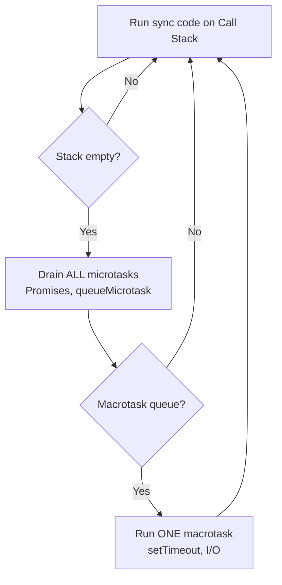
```mermaid
flowchart TD
    A[Run sync code on Call Stack] --> B{Stack empty?}
    B -->|No| A
    B -->|Yes| C[Drain ALL microtasks<br/>Promises, queueMicrotask]
    C --> D{Macrotask queue?}
    D -->|Yes| E[Run ONE macrotask<br/>setTimeout, I/O]
    E --> A
    D -->|No| A
```

---

## Topic 2. Microtasks vs Macrotasks

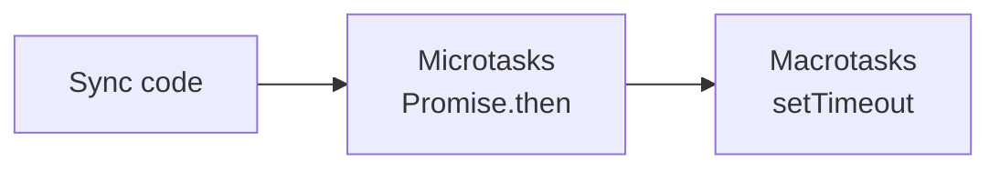
```mermaid
flowchart LR
    S[Sync code] --> M[Microtasks<br/>Promise.then]
    M --> T[Macrotasks<br/>setTimeout]
```

---

## Topic 3. Promise Lifecycle

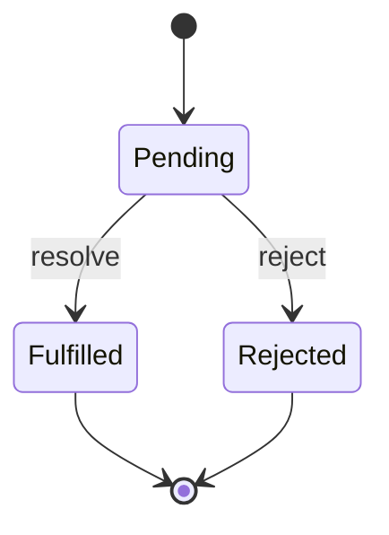
```mermaid
stateDiagram-v2
    [*] --> Pending
    Pending --> Fulfilled: resolve
    Pending --> Rejected: reject
    Fulfilled --> [*]
    Rejected --> [*]
```

---

## Topic 4. async / await

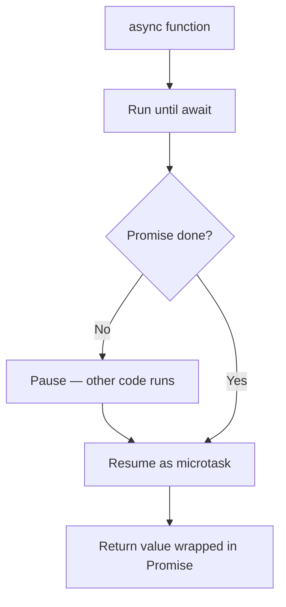
```mermaid
flowchart TD
    A[async function] --> B[Run until await]
    B --> C{Promise done?}
    C -->|No| D[Pause — other code runs]
    D --> E[Resume as microtask]
    C -->|Yes| E
    E --> F[Return value wrapped in Promise]
```

---

## Topic 5. var vs let vs const

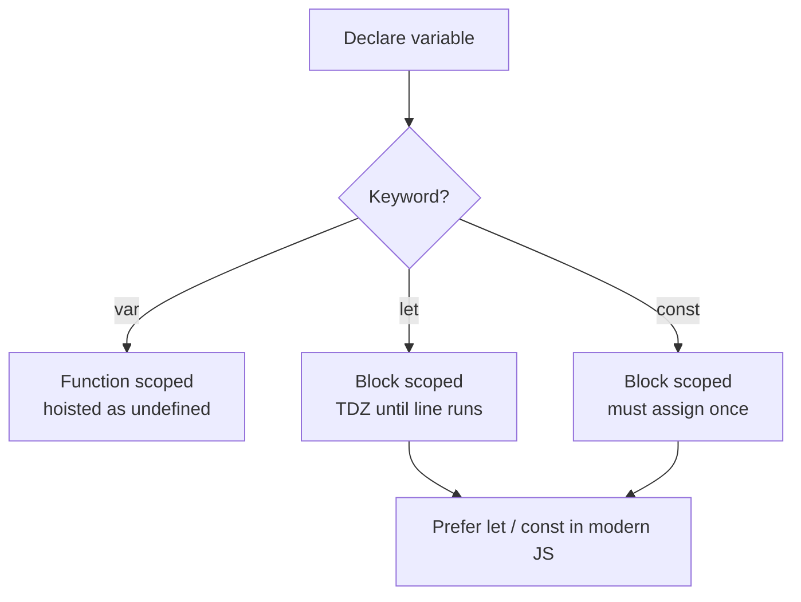
```mermaid
flowchart TD
    A[Declare variable] --> B{Keyword?}
    B -->|var| C[Function scoped<br/>hoisted as undefined]
    B -->|let| D[Block scoped<br/>TDZ until line runs]
    B -->|const| E[Block scoped<br/>must assign once]
    D --> F[Prefer let / const in modern JS]
    E --> F
```

---

## Topic 6. Hoisting & TDZ

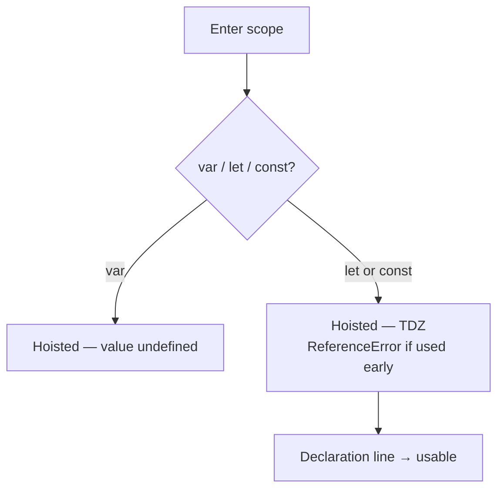
```mermaid
flowchart TD
    A[Enter scope] --> B{var / let / const?}
    B -->|var| C[Hoisted — value undefined]
    B -->|let or const| D[Hoisted — TDZ<br/>ReferenceError if used early]
    D --> E[Declaration line → usable]
```

---

## Topic 7. Prototype Chain

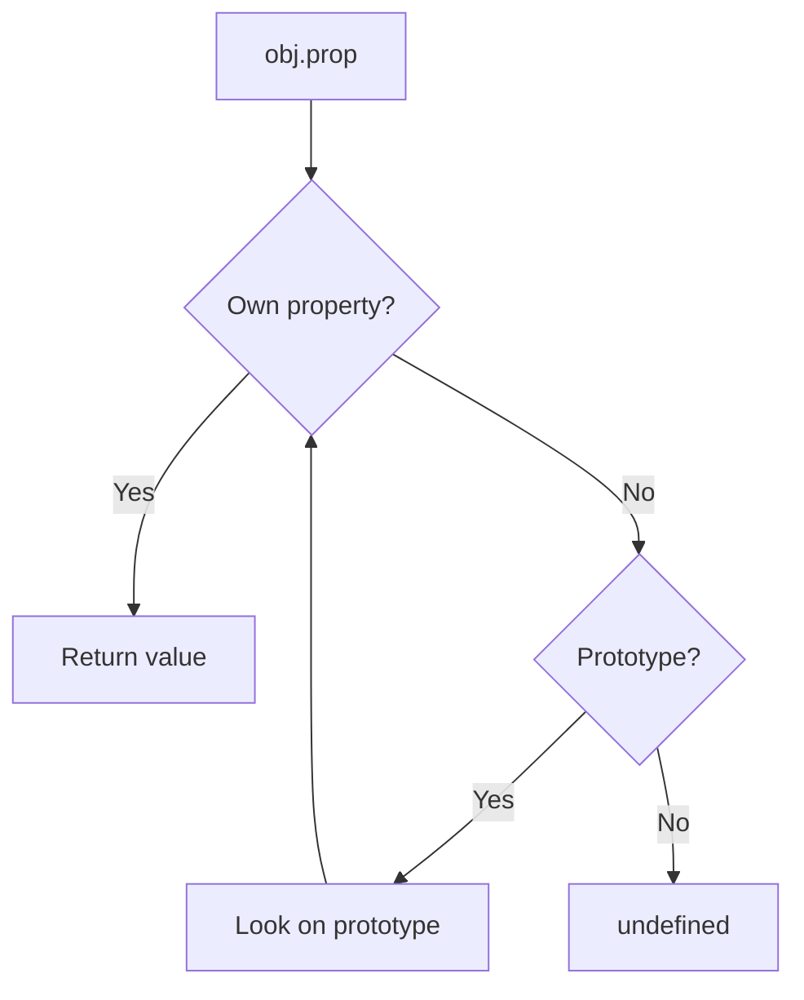
```mermaid
flowchart TD
    A[obj.prop] --> B{Own property?}
    B -->|Yes| C[Return value]
    B -->|No| D{Prototype?}
    D -->|Yes| E[Look on prototype]
    E --> B
    D -->|No| F[undefined]
```

---

## Topic 8. Closures

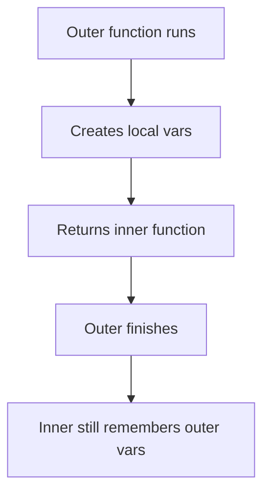
```mermaid
flowchart TD
    A[Outer function runs] --> B[Creates local vars]
    B --> C[Returns inner function]
    C --> D[Outer finishes]
    D --> E[Inner still remembers outer vars]
```

---

## Topic 9. == vs ===

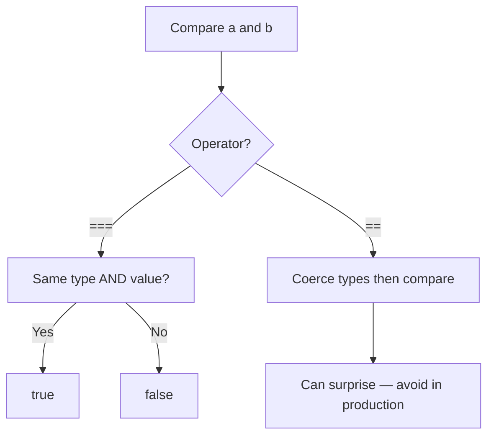
```mermaid
flowchart TD
    A[Compare a and b] --> B{Operator?}
    B -->|===| C[Same type AND value?]
    C -->|Yes| D[true]
    C -->|No| E[false]
    B -->|==| F[Coerce types then compare]
    F --> G[Can surprise — avoid in production]
```

---

## Topic 10. Event Propagation

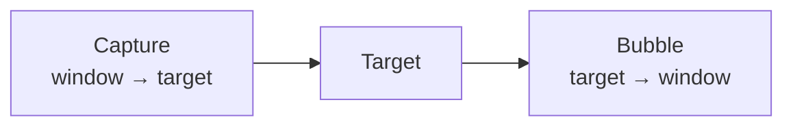
```mermaid
flowchart LR
    A[Capture<br/>window → target] --> B[Target]
    B --> C[Bubble<br/>target → window]
```

---

# Part 2 — Node.js Basics

---

## Topic 11. Node.js Architecture

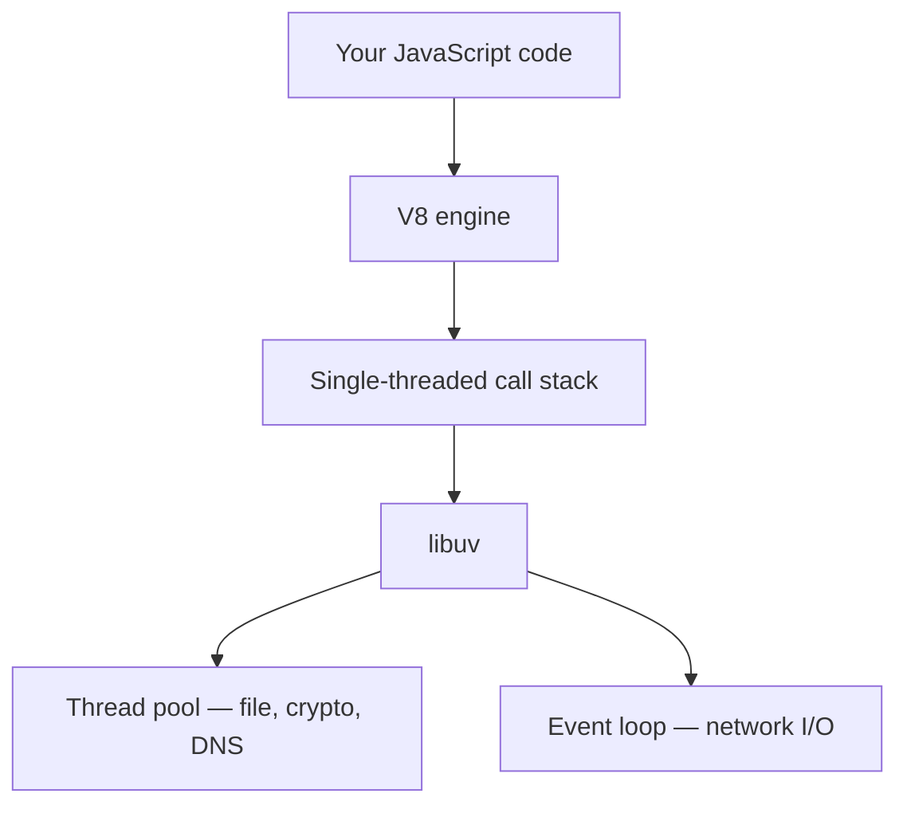
```mermaid
flowchart TD
    A[Your JavaScript code] --> B[V8 engine]
    B --> C[Single-threaded call stack]
    C --> D[libuv]
    D --> E[Thread pool — file, crypto, DNS]
    D --> F[Event loop — network I/O]
```

---

## Topic 12. Node Event Loop

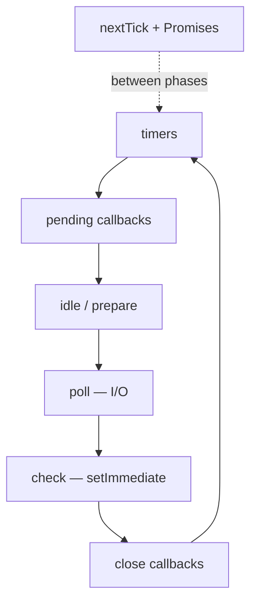
```mermaid
flowchart TD
    A[timers] --> B[pending callbacks]
    B --> C[idle / prepare]
    C --> D[poll — I/O]
    D --> E[check — setImmediate]
    E --> F[close callbacks]
    F --> A
    G[nextTick + Promises] -.->|between phases| A
```

---

## Topic 13. Express Request Flow

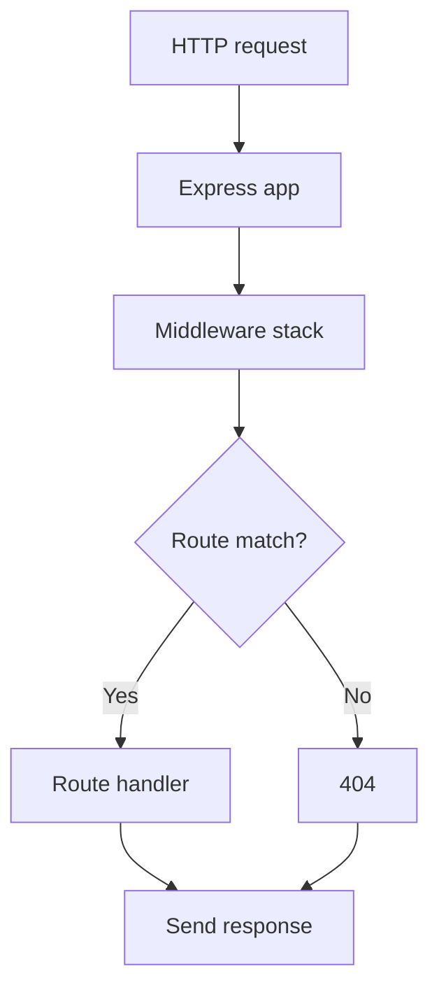
```mermaid
flowchart TD
    A[HTTP request] --> B[Express app]
    B --> C[Middleware stack]
    C --> D{Route match?}
    D -->|Yes| E[Route handler]
    D -->|No| F[404]
    E --> G[Send response]
    F --> G
```

---

## Topic 14. Middleware & next()

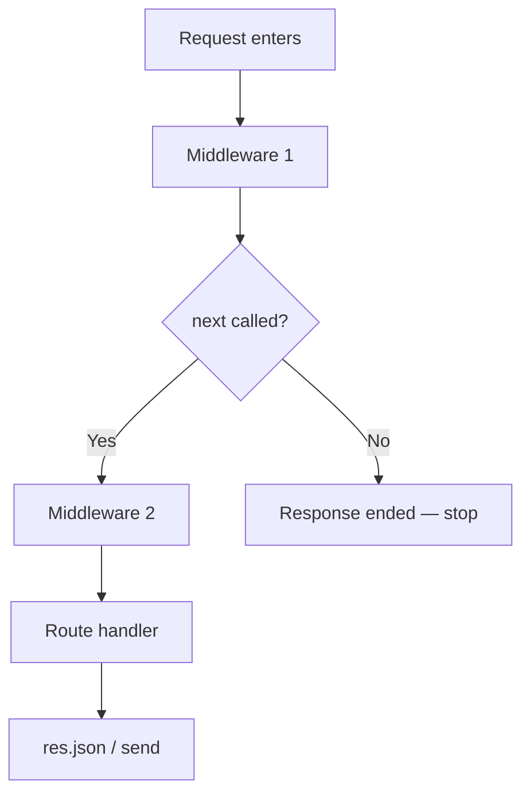
```mermaid
flowchart TD
    A[Request enters] --> B[Middleware 1]
    B --> C{next called?}
    C -->|Yes| D[Middleware 2]
    D --> E[Route handler]
    C -->|No| F[Response ended — stop]
    E --> G[res.json / send]
```

---

## Topic 15. req.params / req.query / req.body

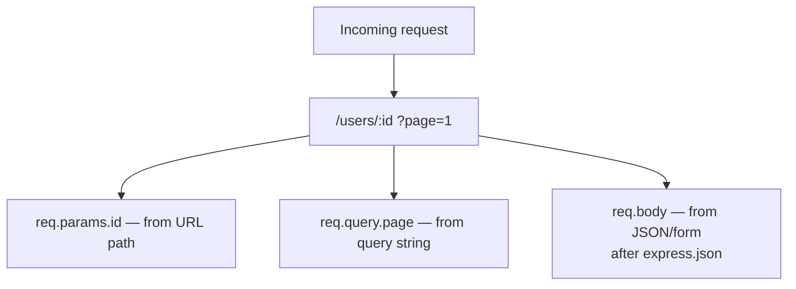
```mermaid
flowchart TD
    A[Incoming request] --> B["/users/:id ?page=1"]
    B --> C[req.params.id — from URL path]
    B --> D[req.query.page — from query string]
    B --> E[req.body — from JSON/form<br/>after express.json]
```

---

## Topic 16. JWT Authentication

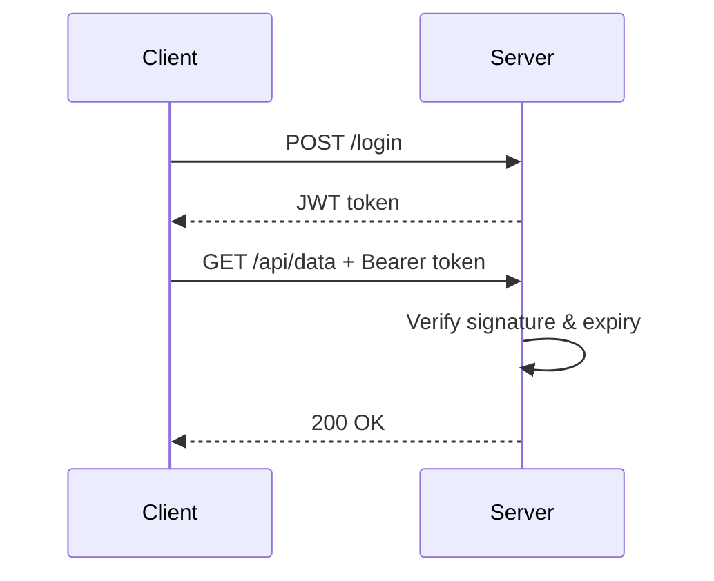
```mermaid
sequenceDiagram
    participant C as Client
    participant S as Server
    C->>S: POST /login
    S-->>C: JWT token
    C->>S: GET /api/data + Bearer token
    S->>S: Verify signature & expiry
    S-->>C: 200 OK
```

---

## Topic 17. Session vs JWT

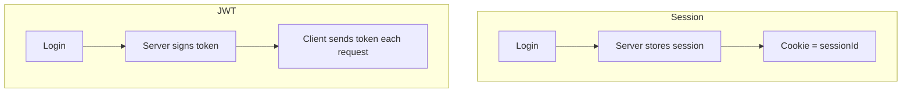
```mermaid
flowchart TD
    subgraph session["Session"]
        S1[Login] --> S2[Server stores session]
        S2 --> S3[Cookie = sessionId]
    end
    subgraph jwt["JWT"]
        J1[Login] --> J2[Server signs token]
        J2 --> J3[Client sends token each request]
    end
```

---

## Topic 18. Streams Pipeline

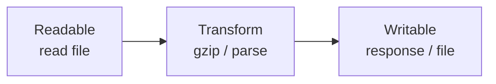
```mermaid
flowchart LR
    A[Readable<br/>read file] --> B[Transform<br/>gzip / parse]
    B --> C[Writable<br/>response / file]
```

---

## Topic 19. Error Handling Middleware

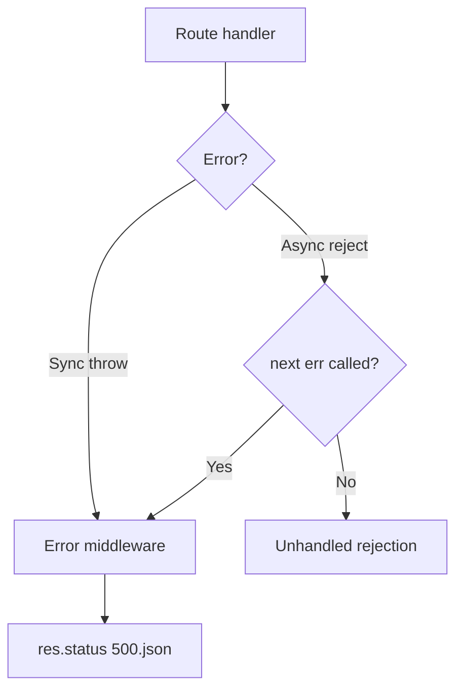
```mermaid
flowchart TD
    A[Route handler] --> B{Error?}
    B -->|Sync throw| C[Error middleware]
    B -->|Async reject| D{next err called?}
    D -->|Yes| C
    D -->|No| E[Unhandled rejection]
    C --> F[res.status 500.json]
```

---

## Topic 20. Safe Input & Validation

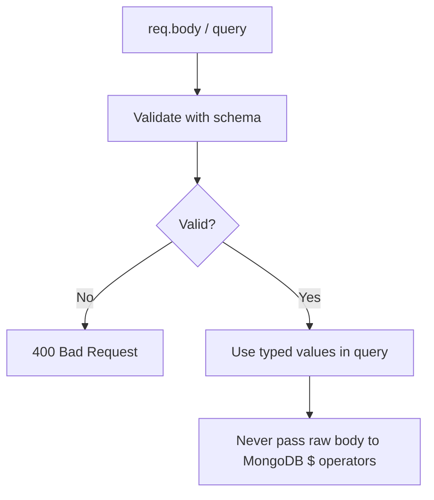
```mermaid
flowchart TD
    A[req.body / query] --> B[Validate with schema]
    B --> C{Valid?}
    C -->|No| D[400 Bad Request]
    C -->|Yes| E[Use typed values in query]
    E --> F[Never pass raw body to MongoDB $ operators]
```

---

## Quick Lookup

| Question | Topic |
|----------|-------|
| Event loop output order? | 1, 2 |
| Promise states? | 3 |
| async/await flow? | 4 |
| var vs let? | 5, 6 |
| Closure? | 8 |
| Express flow? | 13, 14 |
| JWT login? | 16 |
| Session or JWT? | 17 |

---

*Last updated: June 2026 — 20 basic flowcharts · JavaScript & Node.js only*
